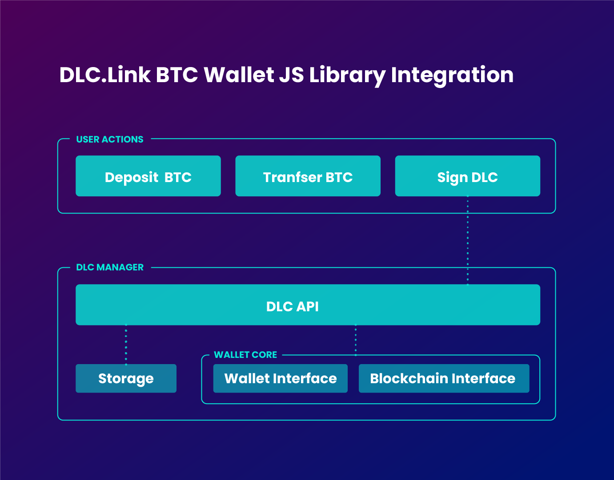

# Bitcoin Wallets

<figure><figcaption></figcaption></figure>

### Bitcoin Wallets

Signing a DLC requires functionality not always present in existing Bitcoin wallets on the market. To fulfill this requirement, DLC.Link will provide open-source libraries in the Rust and JavaScript programming languages.

DLC transactions are handled by two parties, an offeror and an acceptor. In our current setup, the Bitcoin wallet acts as the acceptor and the dApp acts as the offeror. It is the Bitcoin wallet that handles accepting signatures, building and signing Contract Execution Transactions (CETs), and broadcasting onto the BTC blockchain.

There are a few components required to support the dlc-lib library.

Storage

To use the Javascript library it requires Storage. The purpose of this is to store the contracts. This can be local, chrome or your own cloud storage.

```typescript
const storage = new ContractRepository();
```

It is recommended that you create a storage class that implements the following interface.

```typescript
export interface ContractRepository {
    createContract(contract: AnyContract): Promise<void>;
    getContract(contractId: string): Promise <AnyContract>;
    getContracts(query?: ContractQuery): Promise<AnyContract[]>;
    updateContract(contract: AnyContract): Promise<void>;
    deleteContract(contractId: string): Promise<void>;
    hasContract(contractId: string): Promise<boolean>;
}
```

Blockchain Communication

To interact with the Bitcoin network in the context of a Discreet Log Contract, a protocol implementation is required. A bitcoin client facilitates connection to servers that validate transactions and blocks on the Bitcoin blockchain, allowing for interaction with the network.

```typescript
const blockchain = new Blockchain();
```

The following interface should be implemented by a Blockchain class.

```typescript
export interface Blockchain {
    getTransaction(txid: string): Promise<string>;
    sendRawTransaction(txHex: string): Promise<void>;
    getUtxosForAddress(address: string): Promise<Utxo[]>;
    isOutputSpent(txid: string, vout: number): Promise<boolean>;
}
```

Wallet

##

In a Discreet Log Contract (DLC) flow, certain information and functionality provided by a wallet, such as the user's address, public and private keys, unspent transaction outputs (UTXOs), and Schnorr signing capabilities, are necessary for the DLC process. This information can be obtained through the use of a wallet object.

```typescript
const wallet = new Wallet();
```

The following interface should be implemented by a wallet class.

```typescript
export interface Wallet {
   // Get the bitcoin address of the user
 getAddress(): Promise<string>
   // Get the public key of the user
 getPublicKey(): Promise<string>
   // Get the private key associated with the given public key.
 getPrivateKeyForPublicKey(publicKey: string): Promise<string>
 // Get a set of utxos whose total value is at least `amount`. If successful, the utxos are marked as reserved.
 getUtxosForAmount(amount: number, feeRatePerVByte: number): Promise<Utxo[]>
 // Returns a DER encoded signature for the specified input using the private key associated with the given public key.
 getDerTxSignatureFromPubkey(
   tx: Transaction,
   inputIndex: number,
   inputAmount: number,
   pubkey: string,
   outputScript: string
 ): Promise<string>
 // Creates a signature for the given input and fills the transaction input witness.
 signP2WPKHTxInput(
   tx: Transaction,
   inputIndex: number,
   inputAmount: number,
   inputAddress: string
 ): Promise<void>
 // Unreserves a Utxo that was previsously marked as reserved.
 unreserveUtxo(txid: string, vout: number): Promise<void>
 // Returns the network targeted by the wallet
 getNetwork(): Network
}
```

Contract Updater

```typescript
const contractUpdater = new ContractUpdater(wallet, blockchain);
```

The ContractUpdater class is a utility class that is used to manage contracts on a blockchain network. It has several methods that help in preparing and creating DLC contracts, by getting all the inputs, payouts, and transaction details required for the contract, and using the wallet and blockchain instances to interact with the network.

DLC Manager

```typescript
const dlcManager = new DlcManager(contractUpdater, storage);
```

The DlcManager class is a utility class that is used to manage the life cycle of decentralized lending and borrowing contracts on a blockchain network. It has several methods that handle different stages of the contract life cycle, such as creating, accepting, signing, and rejecting contracts.

DLC Service

All communication is handled through the DLCService interface (which is an implementation of DlcAPI) All The functionality we need is wrapped up in it.

```typescript
export class DlcService implements DlcAPI {
constructor(
  readonly dlcManager: DlcManager,
  readonly contractRepository: ContractRepository
) {}
getAllContracts(): Promise<AnyContract[]> {
  return this.contractRepository.getContracts()
}
processContractOffer(offer: string): Promise<AnyContract> {
  const offerMessage = offerMessageFromJson(offer)
  return this.dlcManager.onOfferMessage(offerMessage)
}
processContractSign(sign: string): Promise<AnyContract> {
  return this.dlcManager.onSignMessage(JSON.parse(sign))
}
getContract(contractId: string): Promise<AnyContract> {
  return this.contractRepository.getContract(contractId)
}
acceptContract(contractId: string): Promise<AnyContract> {
  return this.dlcManager.acceptOffer(contractId)
}
rejectContract(contractId: string): Promise<AnyContract> {
  return this.dlcManager.onRejectContract(contractId)
}
}
```

Bitcoin Lending Flow

Step 1: Receive Offer

An offer will be received once the contract is set up in the dApp, sent to the dApp’s DLC-enabled BTC wallet (offeror’s wallet), validated, and signed by the offeror. An offer will include a contract that already contains an Attestor announcement and offeror parameters.

The acceptor’s wallet will receive the offer requests initiated by the contract handling dApp. Following that, we hand the offer to the DlcService.

```typescript
// Get an offer from the backend.
const resp = await axios.get<OfferMessage>(HOST + NEWOFFER + type, {
  transformResponse: [
    (data) => {
      return offerMessageFromJson(data)
    },
  ],
})

//Retrieve the offer from the received data object
const offer = resp.data

// Process the offer.
const offeredContract = await dlcService.processContractOffer(offer);
```

processContractOffer returns an OfferedContract and stores it in the Storage.

Step 2: Accept Offer

The acceptContract function of DlcService is invoked with a temporary contract id when the user accepts the contract.

```typescript
// Accept the offer.
const accept = await dlcService.acceptContract(offeredContract.temporaryContractId);
```

After acceptance, DlcService retrieves the stored contract from the repository, checks for sufficient utxos, collects them, creates a refund signature and constant ID, and gets all CETs signed by parties and Attestor(s), then it returns this extended contract to the Storage so that it can update the stored version accordingly.

Step 3: Sign

After accepting the contract, it should be returned to the dApps' wallet and a signed acceptance message should be received in response.

```typescript
//Get the sign message from the backend wallet.
const sign = (await axios.post<SignMessage>(HOST + POSTACCEPT, accept)).data;

//Process the sign message.
await dlcService.processContractSign(sign)
```

Then it should pass this message to the assigned processContractSign function of the DlcService. This function handles signing and verifying the contract signatures, and updates the contract information in storage.

Step 4: Broadcast

Once all necessary signatures and verifications have been completed, the contractUpdater sends the transaction to the blockchain.
