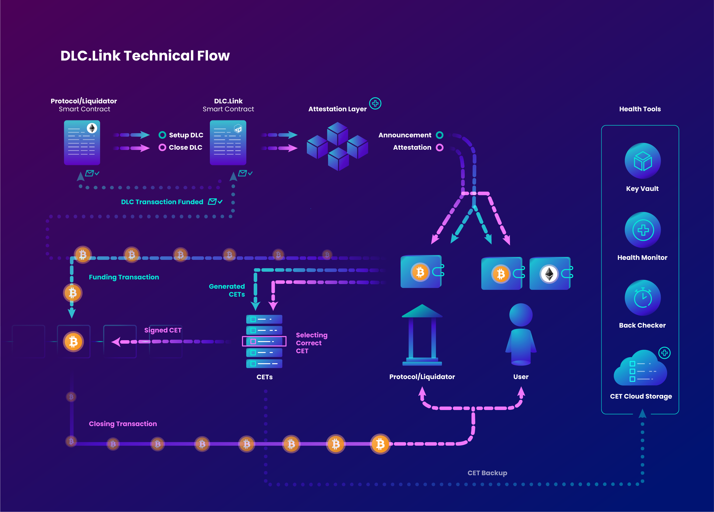

# Architecture Overview

## Philosophy

Bitcoin has become a global phenomenon and a secure store of value, free from government interference and institutional risks. Despite its advantages, Bitcoin's security measures limit its programmability, lacking a smart contract interface for robust financial applications.

Ethereum and other chains have filled this gap with their robust smart contract platforms, driving tremendous growth but also leading to speculation and perceived risks. In the Bitcoin community, Decentralized Finance (DeFi) can be seen as a high-risk venture, associated with volatility and public perception issues.

We believe that Bitcoin is ideal as a settlement layer, to be used within decentralized financial systems on other platforms. Using Bitcoin as a store of value that secures sophisticated applications across various blockchains reduces risks and aligns with a decentralized vision.

Please read more about our philosophy here: [https://www.dlc.link/blog/introducing-the-bitcoin-plus-mentality](https://www.dlc.link/blog/introducing-the-bitcoin-plus-mentality)

## How DLCs Achieve This Vision

Discreet Log Contracts (DLCs) create a secure and decentralized framework for financial transactions. By predefining possible outcomes for locked Bitcoin collateral, and running the business logic on a blockchain in smart contracts, DLCs significantly minimize the potential for errors or malicious acts.&#x20;

This structure also ensures that the details of Bitcoin payments and wallets are kept secret, aligning with the principles of privacy and trustlessness. Furthermore, the use of Bitcoin Attestors in a consensus-based, abstract manner adds another layer of security, leveraging the power of decentralized security while maintaining integrity and trust in the system.

## Supported Blockchains

Currently we're supporting Ethereum as well as the [Stacks](https://www.stacks.co/) blockchain. Other EVM chains will follow soon, and then Solana, Polkadot, Cosmos and other chains will be added later.

### Onboarding new Blockchains

Onboarding a new blockchain primarily requires launching a DLC-Link management smart contract, and configuring the Attestors to listen to events. Adding new EVM compatible chains requires little effort, but other chains would likely take some weeks, followed by a security assessment and testing phase. Since our tool bridges between native Bitcoin and smart chains, and leverages Bitcoin wallets and decentralized Bitcoin Attestors, it can integrate with nearly any blockchain that handles financial transactions. This flexibility means that there are minimal requirements on the underlying blockchain, allowing for broad development potential.

## Components of a DLC

<figure><figcaption></figcaption></figure>

### A Standard DLC Flow

Here we will describe how a user interaction with the DLC system looks, following along with the picture above.

**Setting up the DLC**

Starting in the top left of the diagram, and following the blue "open DLC" line.

1. The user interacts with a dApp's smart contract, for example to create a new loan or deposit vault in the dApp. Usually a user will indicate how much Bitcoin collateral they want to lock.
2. The dApp smart contract calls the _open-dlc_ function on the DLC.Link smart contract.
3. The DLC.Link attestors pick up the event, and publish a **DLC announcement.**
4. Once the transaction is complete, the dApp contract can optimistically assume the announcement exists on the attestors. It can then show the user a link to lock the Bitcoin into the DLC.
5. The user clicks a button with a label something similar to "Lock Bitcoin." This triggers the DLC-enabled wallet to display the details of the DLC, and upon approval, broadcasts the Bitcoin tx to lock the BTC into the DLC.
   1. Behind the scenes, the DLC flow has a few steps. The first step is that the website requests a DLC Offer message from the dApp's Bitcoin wallet, and hands it off to the user's Bitcoin wallet. The wallets then automatically move through the Accecpt and Sign steps of the DLC flow.
   2. Finally, the user views the details, and chooses to accept. Only then does the Bitcoin tx broadcast and lock BTC into the DLC.
   3. The CETs, which represent the set of possible outcomes of the Bitcoin collateral in the DLC, and are similar to partially signed BTC transactions, are stored encrypted in a secure storage system. They will be used again during the closing flow.
6. When the Bitcoin tx hits 6 confirmations, a message is sent to the dApp's smart contract indicating that the Bitcoin collateral is safely locked in the DLC, and the vault or loan should now be active. _This message indicating the DLC is funded is the responsibility of the dApp's bitcoin wallet application, which is a custom application of DLC.Link. That is because it's in the dApp;s interest to not give out loans incorrectly._&#x20;

The DLC is now set up, the Bitcoin is locked, and the collateral is in-use on the second blockchain.

**Closing the DLC**

Starting in the top left of the diagram, and following the purple "open DLC" line.

1. An event occurs on the smart blockchain, such as repaying a loan or otherwise triggering the close flow of the vault. This calls the _close-dlc_ function on the DLC.Link smart contract.
2. That is picked up by the attestors, which publish a **DLC attestation** signature.
3. Either Bitcoin wallet (user's or dApp's) will periodically check the attestors, and see the attstation has been published. That wallet uses that attestation to sign the winning CET, and broadcast it to the BTC network, then closing the DLC and moving out the BTC.

Now that we've described the whole DLC flow, we can discuss each piece of the technology individually.

### DLC Attestors

The most important part of the DLC.Link architecture is the DLC Attestation Layer. Similar in some ways to "validator networks" on bridges, the DLC Attestors work in two steps:

1. The DLC Attestors create a DLC **announcement** when the user indicates that they want to lock bitcoin. This event is used by the bitcoin wallets.&#x20;
2. Later, the DLC Attestors listen for a corresponding event on Ethereum or Stacks (or other chain) regarding the outcome of the DLC, and sign a corresponding **attestation.**&#x20;

With the **attestation,** the participant's bitcoin wallet is able to sign one and only one of the CETs in the original outcome set. Thus the Bitcoin UTXO is "moved," or assigned to the new wallet based on that CET.

The Bitcoin Attestors consist of independent nodes running DLC Attestor software. They are managed and run by independent third-party node operators, who may run exactly one node each. Together they make up the Bitcoin Attestation Layer for DLC.Link.

In addition to creating announcements and attestations for DLC outcomes, the Attestor fulfills a listening function, responding to the **create** and **payout** events on the corresponding **DLC.Link Manager smart contract**. With no business logic in the Attestor, but rather just a **listen-and-sign** process, discreetness and security are ensured, and through a back-checking entity that verifies the results of the Bitcoin Attestors on-chain we can always ensure that an Attestor is behaving well. This verification guarantees the accuracy of the Attestors' actions and provides assurance against manipulation at any point in the process. It is visable thorugh the **DLC.Link Health Dashboard** (coming soon).

Bitcoin Attestors, operated by various independent node operators, work to attest to the payout outcome in a decentralized manner. Their functionality is abstract, meaning Attestors don't know the specific outcome or participants, enhancing security. Consensus among multiple Attestors is used for signing, leveraging decentralized security. Misbehaving Attestors can be penalized through slashing, maintaining integrity.

Read more about Bitcoin Attestors here: [https://www.dlc.link/blog/what-is-a-bitcoin-attestor](https://www.dlc.link/blog/what-is-a-bitcoin-attestor)

### Bitcoin Wallets

A key component of the DLC.Link architecture is our inclusion in various BTC supporting wallets. DLCs are designed so that the smart contracts and Bitcoin Attestors know as little about the details of the bitcoin payments and wallets as possible. This is a great security feature, and means the wallets themselves need to do a good deal of DLC signing.

Two types of wallets are anticipated as being needed, one for end users, and one for application services that enterprises would run in an automated fashion.&#x20;

For either case, we have developed and built-upon DLC libraries that will provide this functionality.

#### JS Library for Browser Extensions and Mobile Wallets

For end-user wallets, that are often written in JS or ReactNative, we have a JS library that can easily be dropped into existing web/mobile wallets. We have also developed our own DLC-Enabled BTC wallet for testing purposes.

The DLC.Link signing library is publically available here: [https://www.npmjs.com/package/@dlc-link/dlc-tools](https://www.npmjs.com/package/@dlc-link/dlc-tools)

DLC signing is available in the Leather wallet. [https://leather.io/](https://leather.io/)

You can read more about the JS library and setting it up here:  [bitcoin-wallets.md](installation-and-setup/bitcoin-wallets.md "mention")

#### Router Wallet Service

We have released a secure, reliable BTC/DLC signing application for financial institutions and dApps to automate their DLC and Bitcoin interactions. This tool is built in Rust and leverages a well-developed and featureful open-source DLC management project. While this service can sign Bitcoin DLC transactions, it does not have wallet functionality, and does not manage any funds directly.

### Smart Contracts

Smart contract integrations provide enhanced security by allowing both the attestor and the system to verify smart contract outputs directly on-chain. This ensures a transparent and trustworthy process. Our Bitcoin Attestors have been connected to blockchain DApps to leverage this benefit, merging the strength of Bitcoin with cutting-edge platforms for application development. The integration process is made even more attractive by its simplicity, requiring only the implementation of the "Open DLC" and "Close DLC" functions. These functions usually consist of fewer than 30 lines of code, making it an accessible solution that combines robust security with efficiency.

