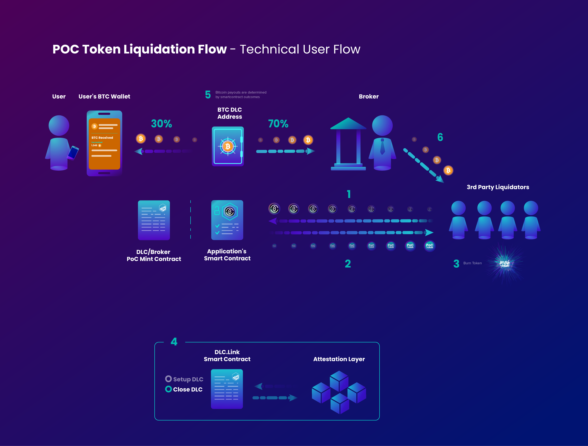

# With Broker and Proof of Collateral Token

DLC.Link is designing an ERC20-compatible token (and after that on other chains as well) which can simply represent the Bitcoin locked in the DLC escrow. This type of token is often referred to as a **Proof of Reserve** or **Proof of Collateral** token.

While this Bitcoin **Proof of Collateral** token does represent the Bitcoin value, it is different from a wrapped-BTC in one very important way. This PoC token doesn't itself hold value. It simply references and identifies that Bitcoin is held elsewhere, and can potentially be leveraged by an official **Bridge**.

As a DLC needs to be opened between 2 Bitcoin wallet holders, only those two participants can ever actually access the Bitcoin funds. The PoC token simply makes programming against that collateral easier. This is especially true when wanting to use the collateral on a defi lending platform e.g. Curve or AAVE.

So in this way, the token is much **safer** than a traditional Wrapped Bitcoin.

As the PoC token is minted when locking Bitcoin in a DLC, it is likewise burned in order to free the Bitcoin from the DLC. This is done via the same **Bridge** that originally minted it. In order for the token holder prior to burning to get the value of the Bitcoin, they must have a previous existing relationship with the **Bridge**.&#x20;

### Setup Loan Flow with Proof of Collateral Token

Below is a diagram showing how a PoC token is minted by a **Broker** or perhaps by the DLC.Link service itself, when a user locks their Bitcoin into a DLC. Once minted, the PoC ERC20 token represents a guarantee that funds exist and can't be moved. The PoC token is then sent to a defi platform to be used as collateral.

When the borrower wants to access their Bitcoin again, they simply repay the funds, get their PoC token back, and burn it, which unlocks the DLC and their collateral is returned.

<figure><figcaption></figcaption></figure>

### Liquidation Flow with Proof of Reserve Token

In a liquidation case, however, the **Broker** or another liquidator buys the PoC token from the defi platform. The ERC20 PoC token can be held or traded as desired.&#x20;

When the token holder wants to redeem the Bitcoin collateral, they need an account with the **Bridge** that originally minted the token. Then they burn the token, and the funds are send to them by the **Bridge**.

<figure><figcaption></figcaption></figure>
