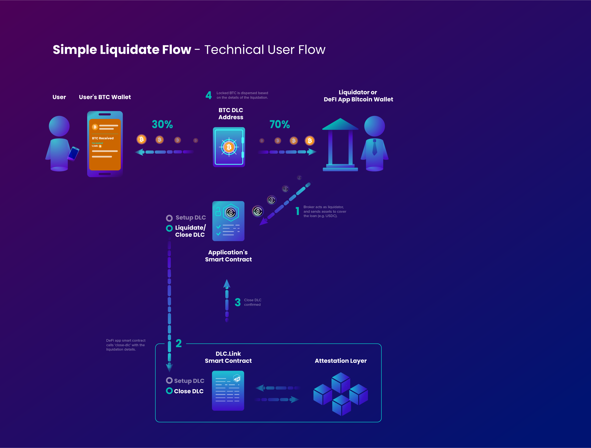
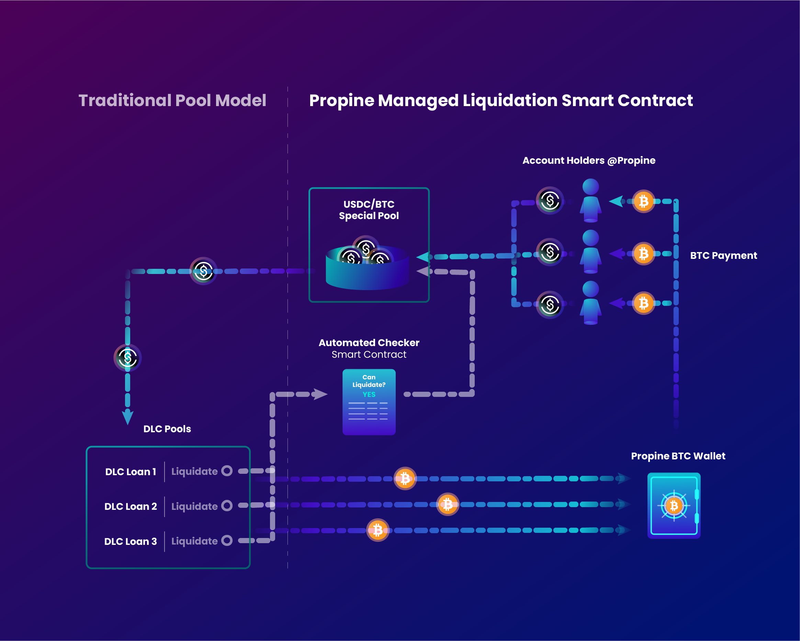

# With Broker

In order for a lender to eliminate their own need to manage native Bitcoin payments, the system can be designed with what we're calling a **Broker**. This agent participates in the DLC with the borrower, and guarantees that, in case of a liquidation event, the borrowed asset will be repaid, thus leaving the Bitcoin collateral to be sent and managed by the **Broker**.

Here is the same Simple flow shows in the previous Simple Case, but with a Broker participating in the collateral contract.

### Simple Liquidation Flow with Broker

If the user were to repay the loan, the **Broker** ends up not participating in the payments, as everything is covered between the borrower and the protocol.\
\
However, in the liquidation case, the **Broker** will be collecting the collateral, and thus prior to that is responsible for suring-up the loaned asset. In the example below, the **Broker** pays USDC stablecoin to cover the loan, and once the DLC is signed, the Bitcoin collateral is sent to the **Broker** to cover their costs plus fees.

<figure><figcaption></figcaption></figure>

### Isolated Liquidity Pool - Liquidation Flow

#### What is an Isolated Liquidity Pool?

The term Isolated Liquidity Pool refers to a Smart Contract that allows for multiple independent participants to support a **Broker** during a liquidation event. The pool of liquidators is referred to as _isolated_ because it's totally unaffiliated with the original loan, and only participates in the liquidation process via the **Broker's** smart contract, or other internal system.

See below for an example setup of a **Broker** supported Bitcoin-collateral loan with an isolated liquidity pool.

<figure><figcaption></figcaption></figure>

### Detailed View of Propine Isolated Liquidity Pool

Here you can see an example of the internals of the isolated liquidity pool, continuing from the previous defi lending example we've been development so far.

In this diagram, the liquidators are account holders on the Propine platform. They can use funds with Propine to pool into a liquidation fund, which covers the native Bitcoin collateralized loan. When the native Bitcoin payment is received by a Propine Bitcoin wallet, the funds can be disbursed to the account holders.

<figure><figcaption></figcaption></figure>
