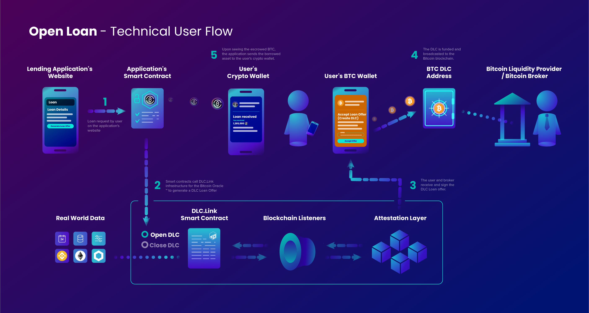
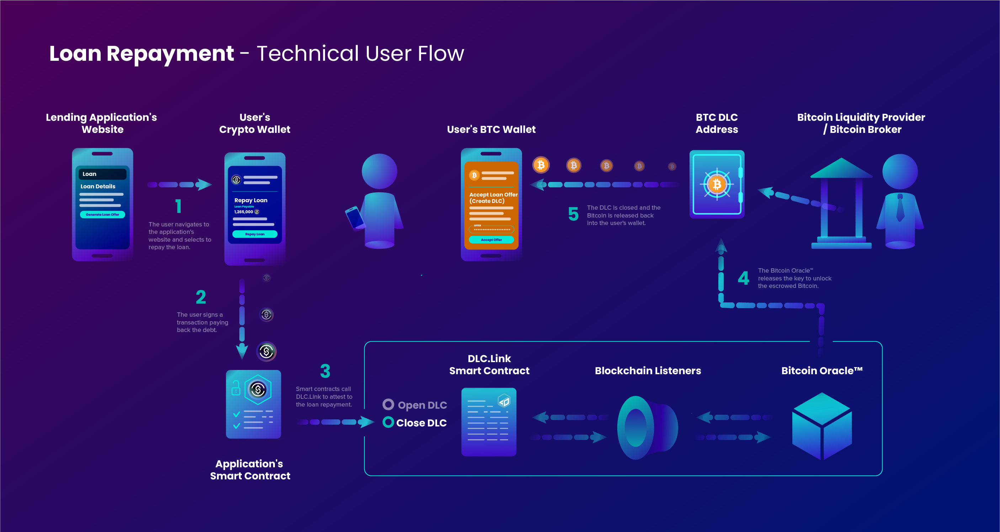

# Technical Application Flow

### Components

At a high level, the most important parts of the DLC.Link technical systems architecture are the following:

* The Bitcoin (DLC) Oracle(TM), which acts as the mediator by signing the outcome for the DLC participants, ([learn more about DLCs](../additional-resources/discreet-log-contracts.md))
* the smart contracts, from the application (defi, betting, escrow, etc) using DLCs, and the DLC.Link Management Contract,
* and the wallets that participate in the DLC.&#x20;

The DLC.Link architecture can be understood more thoroughly through the example of the defi lending case.

### Open Loan Flow Example

<figure><figcaption></figcaption></figure>

In the below example, a user wants to use native, self-custodial bitcoin as collateral for a stable-coin loan on a blockchain such as Ethereum, Stacks, or many others.&#x20;

1. The user browses to the defi application's webpage and fills in the details of the loan they want to take, using BTC as collateral.
2. The defi application updates their smart contract on the blockchain to setup a new collateralized loan, and calls to the DLC.Link smart contract to set up the bitcoin DLC contract on the Bitcoin Oracle.
3. The details of the DLC from the Bitcoin Oracle are forwarded to the user, who can review and sign the DLC with their DLC-enabled bitcoin wallet. The application also signs their side of the DLC using provided the DLC.Link protocol wallet service.
4. Once signed, the DLC transaction is submitted to the bitcoin blockchain. The application's smart contract is notified once the DLC is confirmed.&#x20;
5. The application's smart contract now has a guarantee of BTC collateral, and releases the loaned asset (stable coin, etc) into the user's wallet.

### Close Loan Flow

<figure><figcaption></figcaption></figure>

The user wants to repay their stable-coin loan and regain access to their bitcoin collateral.&#x20;

1. The user navigates to the defi applications webpage and chooses to repay the loan.
2. The user initiates the sending of the stable-coin via the application's smart contract.
3. The application's smart contact communicates with the DLC.Link management smart contract to begin the closing of the DLC. The Bitcoin Oracle signs an outcome for the repayment (other possible outcome could have been liquidation). \
   A callback to the application's smart contract notifies it that the DLC is ready to be closed, and the defi applications website is updated.
4. The application's protocol wallet puts the closing transaction on the BTC blockchain.
5. &#x20;The user can now see the funds in their BTC wallet, and the loan closing is complete.
