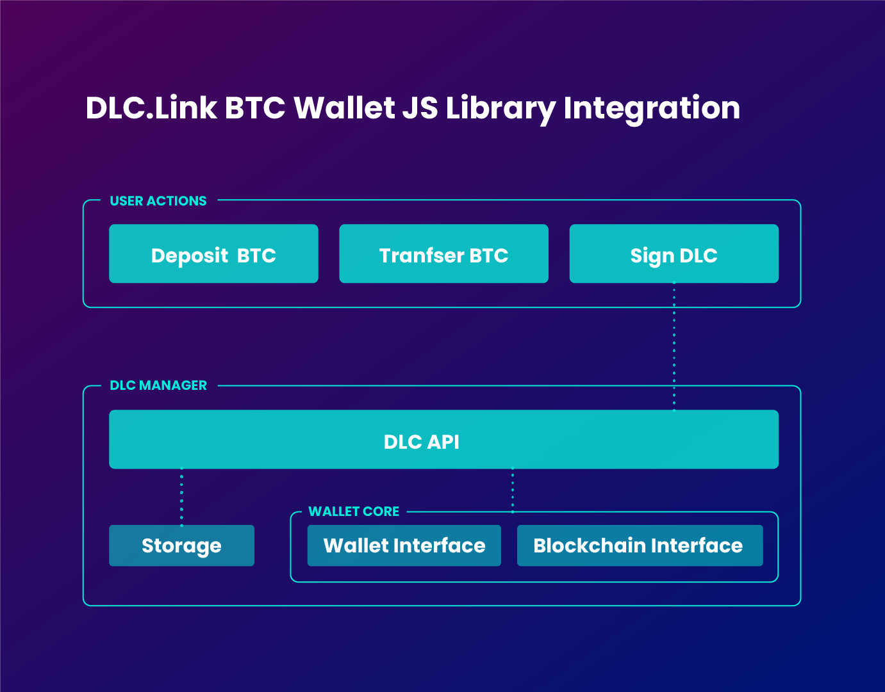

# 比特币钱包

关于如何在Leather(原Hiro)钱包中使用DLCs的说明，请访问:



## Bitcoin Wallet Overview

签署DLC需要的功能并不总是存在于市场上现有的比特币钱包中。为了满足这一要求，DLC.Link将提供Rust和JavaScript编程语言的开源库。

DLC交易由两方处理，即要约人和承兑人。在我们当前的设置中，比特币钱包充当接受者，dApp充当提供者。它是处理接受签名，构建和签署合同执行交易(CETs)的比特币钱包，并广播到BTC区块链上。

### Javascript DLC 接口的实例化

首先，使用npm安装DLC接口:

```bash
npm install dlc-wasm-wallet
```

然后将DLC界面导入到项目中:

```typescript
import { JsDLCInterface } from 'dlc-wasm-wallet';
```

在使用谨慎日志合约(DLC)接口建立DLC之前，您必须使用特定的信息初始化它。这包括由比特币钱包提供的数据，例如用户的私钥、地址、选择的比特币网络、它的API端点以及证明方端点的URLs。

在提供了具体信息之后，您可以使用以下函数 `new`实例化DLC接口:

```ts
interface JsDLCInterface {
  new (
    userPrivateKey: string, // The user's private key.
    userAddress: string, // The user's address.
    bitcoinNetwork: string, // The Bitcoin network.
    bitcoinNetworkAPI: string, // The Bitcoin network API endpoint.
    attestorURLs: string // An array of attestor API endpoints (string[]), which has been converted into a JSON string.
  ): JsDLCInterface;
}
```

注意:在使用它们作为参数之前，确保所有必要的字段都是JSON字符串化的，因为接口使用JSON格式操作。

在底层，创建了一个`DlcManager`实例。

DlcManager用于管理区块链网络上分散的借贷合同的生命周期。它有几个方法来处理合同生命周期的不同阶段，比如创建、接受、签署和拒绝合同。\


<figure><figcaption></figcaption></figure>

## 比特币接待流程

### 第一步/收到报价

一旦合同在dApp中建立，发送到dApp的Router钱包(要约人的钱包)，经过验证并由要约人签名，就会收到要约。要约将包括一份合同，该合同已包含认证人公告和要约人参数。

如果您不熟悉如何从dApp请求报价，请参阅[Interacting with Bitcoin Contracts](../../architecture/interacting-with-bitcoin-contracts.md)。

收到要约后，比特币钱包可以审查合同并决定是否接受或拒绝。

### Step 2 | Accept Offer第二步/接受报价

要接受比特币合约报价，必须使用`accept_offer()` 函数，该函数接受JSON格式的比特币合约报价作为参数。

当用户接受合约时，DLC接口的`accept_offer()`函数将使用临时合约id调用。

```ts
const bitcoinContractJSON = JSON.stringify(bitcoinContractOffer);

const acceptedBitcoinContract = await bitcoinContractInterface.accept_offer(bitcoinContractJSON);
```

一旦被接受，DlcManager会验证是否有足够的utxos可用，收集它们，并构建一个带有恒定id的退款签名。然后，它确保所有的CETs都由相关方和认证人签名。最后，它将合同保存在云存储中，并将其与用户的公钥关联起来。

### 第三步/发送接受要约到Router 钱包

在签署和广播比特币合约之前，您必须将接受的比特币合约报价发送到dApp的Router钱包。要做到这一点，你应该利用一个类似于下面的函数:

```ts
async function sendAcceptedBitcoinContractOfferToRouterWallet(
  acceptedBitcoinContractOffer: string,
  counterpartyWalletURL: string
) {
  return fetch(`${counterpartyWalletURL}/offer/accept`, {
    method: 'put',
    body: JSON.stringify({
      acceptMessage: acceptedBitcoinContractOffer,
    }),
    headers: { 'Content-Type': 'application/json' },
  }).then((res) => res.json());
}

const signedBitcoinContract = await sendAcceptedBitcoinContractOfferToRouterWallet(
  acceptedBitcoinContract,
  counterpartyWalletURL
);
```

如果Router钱包成功验证了接受的比特币合约报价，它将签署合约并将其返回给比特币钱包。

### Step 4 | Sign and Broadcast第四步/签名与广播

要签名和广播比特币合约，必须使用countersign\_and\_broadcast()函数，该函数接受JSON格式的签名比特币合约作为参数。

```ts
const signedBitcoinContractJSON = JSON.stringify(signedBitcoinContract);

const txID = await bitcoinContractInterface.countersign_and_broadcast(signedBitcoinContractJSON);
```

该函数处理合同的签名和验证，并更新云存储中的合同。

函数执行后，比特币钱包将把合约广播到比特币区块链上。它返回合约的交易ID，你可以用它来跟踪区块链上的交易。
