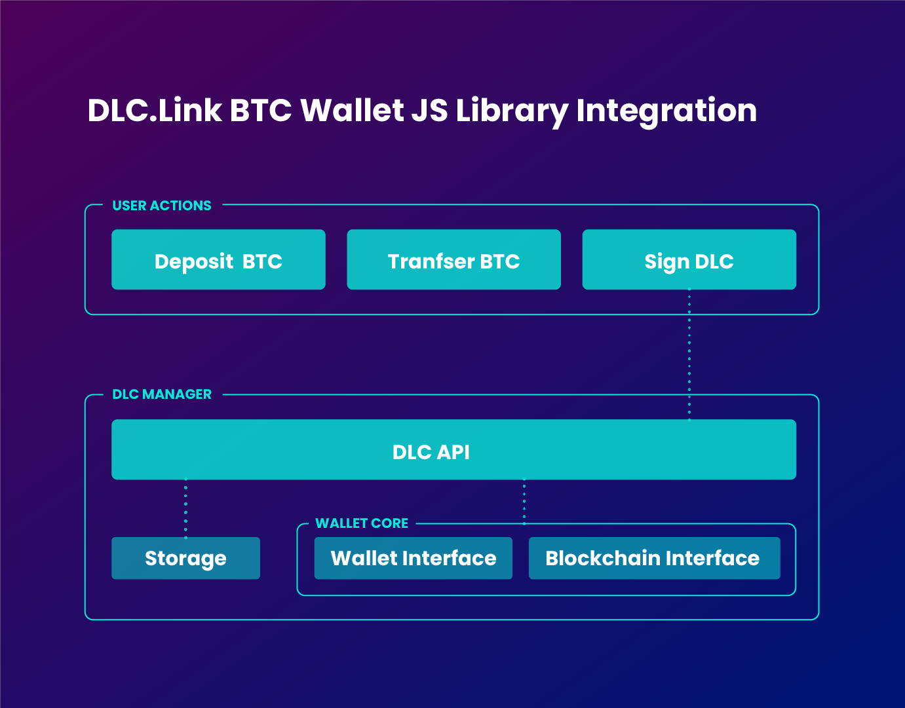

# Bitcoin Wallets

For instructions on how to use DLCs in Leather (formerly Hiro) wallet, please visit:



## Bitcoin Wallet Overview

Signing a DLC requires new functionality that is not yet present in Bitcoin wallets. To fulfill this requirement, DLC.Link provides open-source libraries in Rust and JavaScript.

DLC transactions are handled by two parties, an offeror and an acceptor. In our current setup, the Bitcoin wallet acts as the acceptor and the dApp acts as the offeror. It is the Bitcoin wallet that handles accepting signatures, building and signing Contract Execution Transactions (CETs), and broadcasting onto the BTC blockchain.

### Instantiaton of the Javascript DLC Interface

First install the DLC interface using npm:

```bash
npm install dlc-wasm-wallet
```

Then import the DLC interface into your project:

```typescript
import { JsDLCInterface } from 'dlc-wasm-wallet';
```

Before using the Discreet Log Contract (DLC) interface to establish a DLC, you must initiate it with specific information. This includes data provided by a Bitcoin wallet, such as the user's private key, address, the selected Bitcoin network, it's API endpoint, and the URLs for the attestors' endpoints.

After the specific information is provided, you can instantiate the DLC interface with the following function called `new`:

```ts
interface JsDLCInterface {
  new (
    userPrivateKey: string, // The user's private key.
    userAddress: string, // The user's address.
    bitcoinNetwork: string, // The Bitcoin network.
    bitcoinNetworkAPI: string, // The Bitcoin network API endpoint.
    attestorURLs: string // An array of attestor API endpoints (string[]), which has been converted into a JSON string.
  ): JsDLCInterface;
}
```

_Note_ Ensure that all the necessary fields are JSON-stringified before utilizing them as param, as the interface operates using JSON format.

Under the hood, a `DlcManager` instance is created.

The DlcManager is used to manage the life cycle of decentralized lending and borrowing contracts on a blockchain network. It has several methods that handle different stages of the contract life cycle, such as creating, accepting, signing, and rejecting contracts.

<figure><figcaption></figcaption></figure>

## Bitcoin Lending Flow

### Step 1 | Receive Offer

An offer will be received once the contract is set up in the dApp, sent to the dApp’s Router Wallet (offeror’s wallet), validated, and signed by the offeror. An offer will include a contract that already contains the attestor announcements and offeror parameters.

If you are not familiar with how to request an offer from the dApp, please refer to the [Interacting with Bitcoin Contracts](../../architecture/interacting-with-bitcoin-contracts.md) section.

After the offer is received, the Bitcoin Wallet can review the contract and decide whether to accept or reject it.

### Step 2 | Accept Offer

To accept a Bitcoin Contract Offer, you must utilize the `accept_offer()` function, which accepts a Bitcoin Contract offer in JSON format as a param.

The `accept_offer()` function of the DLC interface is invoked with a temporary contract id when the user accepts the contract.

```ts
const bitcoinContractJSON = JSON.stringify(bitcoinContractOffer);

const acceptedBitcoinContract = await bitcoinContractInterface.accept_offer(bitcoinContractJSON);
```

Once accepted, the DlcManager verifies the availability of sufficient utxos, gathers them, and constructs a refund signature along with a constant id. It then ensures that all CETs are signed by the involved parties and attestor(s). Finally, it saves the contract in the cloud storage, associating it with the user's public key.

### Step 3 | Send Accepted Offer to Router Wallet

Before signing and broadcasting a Bitcoin Contract, you must send the accepted Bitcoin Contract Offer to the dApp's Router Wallet. To do so, you should ulitize a function similar to the following:

```ts
async function sendAcceptedBitcoinContractOfferToRouterWallet(
  acceptedBitcoinContractOffer: string,
  counterpartyWalletURL: string
) {
  return fetch(`${counterpartyWalletURL}/offer/accept`, {
    method: 'put',
    body: JSON.stringify({
      acceptMessage: acceptedBitcoinContractOffer,
    }),
    headers: { 'Content-Type': 'application/json' },
  }).then((res) => res.json());
}

const signedBitcoinContract = await sendAcceptedBitcoinContractOfferToRouterWallet(
  acceptedBitcoinContract,
  counterpartyWalletURL
);
```

If the Router Wallet succesfully validates the accepted Bitcoin Contract offer, it will sign the contract and return it to the Bitcoin Wallet.

### Step 4 | Sign and Broadcast

To sign and broadcast a Bitcoin Contract, you must utilize the countersign\_and\_broadcast() function, which accepts a signed Bitcoin Contract in JSON format as a param.

```ts
const signedBitcoinContractJSON = JSON.stringify(signedBitcoinContract);

const txID = await bitcoinContractInterface.countersign_and_broadcast(signedBitcoinContractJSON);
```

This function handles signing and verifying the contract signatures, and updates the contract in the cloud-storage.

After the function is executed, the Bitcoin Wallet will broadcast the contract onto the Bitcoin blockchain. It returns the transaction ID of the contract, which you can use to track the transaction on the blockchain.
