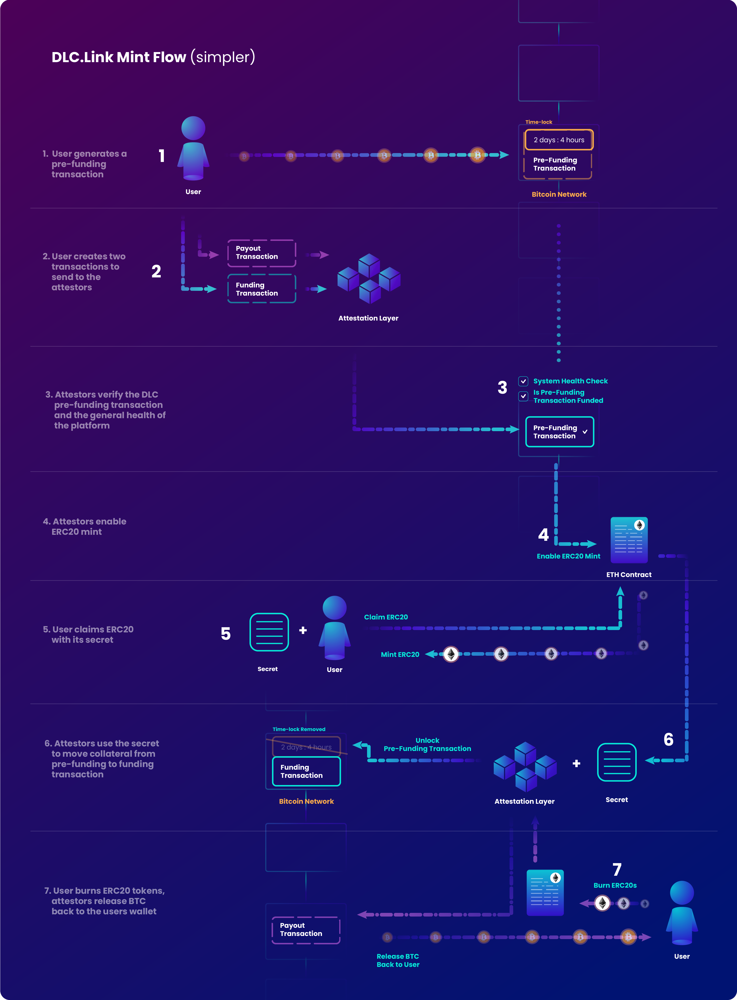

# 技术概览

### 理论基础

比特币已经成为一种全球现象和安全的价值储存手段，不受政府干预和制度风险的影响。尽管比特币具有优势，但其安全措施限制了其可编程性，缺乏用于强大金融应用程序的智能合约接口。

以太坊和其他区块链以其强大的智能合约平台填补了这一空白，推动了巨大的增长，但也导致了投机和感观风险。在比特币社区，去中心化金融(DeFi)可以被视为一项高风险投资，与波动性和公众认知问题有关。

我们认为，比特币是理想的结算层，可以在其他平台上的分散金融系统中使用。使用比特币作为一种价值存储，可以保护跨各种区块链的复杂应用程序，从而降低风险，并符合去中心化的愿景。

[请在这里阅读更多关于我们的理念:https://www.dlc.link/blog/introducing-the-bitcoin-plus-mentality](https://www.dlc.link/blog/introducing-the-bitcoin-plus-mentality)​

## DLCs 如何实现这一愿景

DLCs为金融交易创造了一个安全和分散的框架。通过预先定义锁定比特币抵押品的可能结果，并在智能合约的区块链上运行业务逻辑，DLCs显著减少了错误或恶意行为的可能性。

这种结构还确保了比特币支付和钱包的细节是保密的，符合隐私和无需信任的原则。此外，以基于共识的抽象方式使用比特币证明增加了另一层安全性，利用去中心化安全的力量，同时保持系统的完整可信。

## 支持多链

目前我们支持以太坊和相应的L2区块链。随后将支持其他EVM链以及Solana, Polkadot, Cosmos等其它区块链。

## DLC实现的步骤

<figure><figcaption></figcaption></figure>

### 一个标准的DLC 流程

**铸造流程**

1. 用户在自己和DLC.Link的比特币桥之间发起atomic swap。这就是所谓的充值前交易。这意味着用户将他们的比特币锁定到一个时间锁的交易中，如果在这个过程中出现任何问题，就会自动取回比特币。例如，如果用户不认领ERC20代币，他们的比特币将自动返回给他们。
2. 用户创建两个交易(部分签名的比特币交易)发送给认证者。
3.
   1. 第一个被称为充值交易，将用于支出来自充值前交易的UTXOs。
   2. 第二个，被称为支付交易，将被用作DLC未来的最终支付。通过这种方式，只能将锁定的抵押品发送回原始所有者。
4. 认证者网络进入验证阶段，验证DLC预充值交易是否被确认和有效，并检查平台的总体安全状况，以确保一切正常。
5. 确保一切都有效，则认证人调用桥接EVM合约上的setup函数，准备ERC20 代币 dlcBTC。
6. 当用户从hash 中领取ERC20代币时，作为atomic swap过程的一部分，她需要向证明方透露一个密钥。
7. 认证人使用该密钥将预充值交易解锁为标准DLC充值交易，并持续保存，直至用户赎回时偿还。

**赎回流程**

1. 之后，当ERC20代币被烧毁时，认证者从智能合约中获取该事件，签署结束交易，用户的BTC被转回他们的钱包。

既然我们已经描述了整个DLC流程，我们可以单独讨论每个技术部分。

## DLC.Link 技术架构的组件

### DLC 认证人

DLC.Link技术架构中最重要的部分是DLC认证层。在某些方面类似于跨链桥上的“验证器网络”，DLC认证人的工作有两个主要功能:

1. **将BTC 桥接到EVM链**
   1. DLC.Link的认证人接受BTC桥接请求的详细信息(包括PSBT和锁定交易)，并检查控制EVM合约的状态。
   2. 一旦在BTC链上得到验证和确认，节点就会形成共识，并使用阈值ECDSA签名对智能合约执行桥接操作。利用DLC.Link 桥铸造dlcBTC代币。
2. **将BTC 从EVM 链赎回**
   1. 之后，DLC.Link的认证者将监听EVM上的相应事件。在DLC.Link桥的情况下，这将是关联的dlcBTC代币的销毁。见证者们形成共识，并签署一个Schnorr阈值签名，以解锁之前锁定的BTC抵押品，并广播比特币交易。
   2. 当赎回交易被确认时，他们再次形成共识，并使用阈值ECDSA签名来结束DLC流程。

比特币认证者们由运行DLC认证者软件的独立节点组成。它们由独立的第三方节点运营商管理和运行，每个运营商可能运行一个节点。它们共同构成了DLC.Link的比特币认证层。

没有在认证者中加入业务逻辑，而是仅采用监听和签名机制，从而确保了隐私性和安全性。通过所有节点运行的声誉系统和后检机构，该机构在链上验证比特币认证者的结果，我们可以确保认证者的行为是恰当的。这种验证保障了认证者行动的准确性，并对流程中的任何点的操纵提供了保障。这一过程将通过DLC.Link健康仪表板（即将推出）完全可见。

由各种独立节点运营商操作的比特币认证者，以去中心化的方式证明支付结果。通过削减处罚可以惩罚行为不当的认证者，以维护系统的完整性。

在这里阅读更多关于比特币认证者的信息: [https://www.dlc.link/blog/what-is-a-bitcoin-attestor](https://www.dlc.link/blog/what-is-a-bitcoin-attestor)

### 支持的比特币钱包

DLC.Link技术适用于任何支持Taproot的钱包, 并能签署PSBTs。我们正在努力整理一份已确认兼容的钱包列表（即将推出）。

### 智能合约

我们相信比特币的力量将在它被无需信任地桥接到一个可信的智能合约链上时得到充分发挥。因此，我们通过在EVM链上的安全且经过严格审计的智能合约来支持我们的DLC.Link认证者。通过这种设计，验证桥接是否正确操作（审计）变得简单明了，因为认证者仅负责对来自EVM合约的请求进行共识签名。

我们的合约是完全开源的，可以在这个文档页面的Solidity部分找到。

