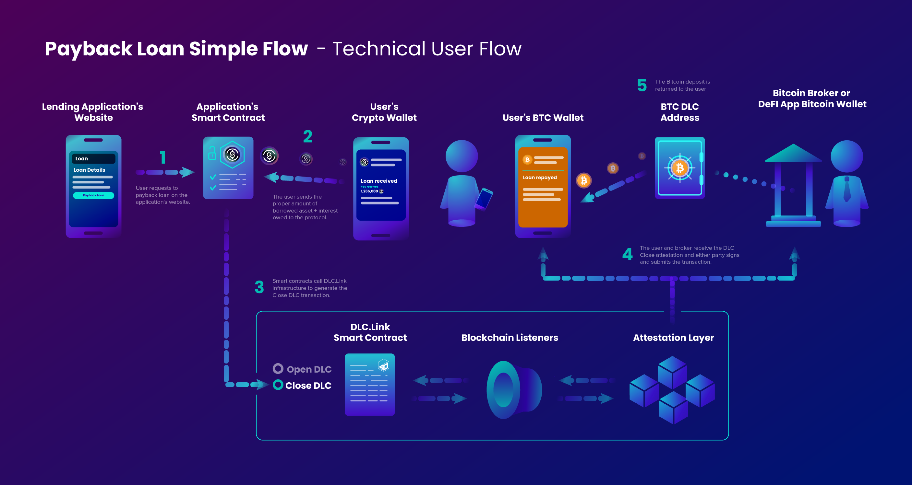

# Repayment

As simple as it is for a user to borrow funds from their Bitcoin, it is the reverse process for closing the loan. Simply pay back the borrowed asset, plus interest and fees, to received your Bitcoin back into your wallet.

<figure><figcaption></figcaption></figure>
