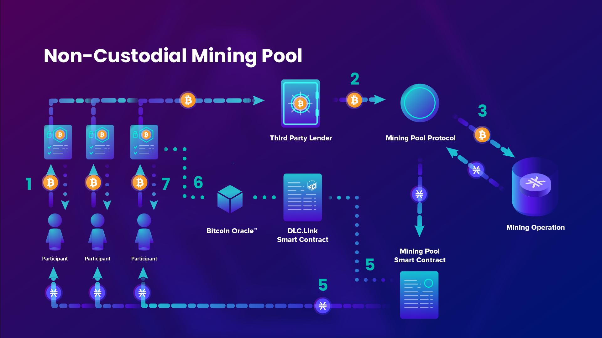

# Non-Custodial Mining Pool

## Use Case

The following use case is inspired by a design from the Syvita Mining Protocol team.

10 miners (pool participants who stake BTC to earn STX rewards) each lock .5 BTC into several DLCs (one per user) with the BTC Lender. The Lender loans 5 BTC to the Mining Pool protocol from their own source of funds. Then the Mining Pool protocol uses this BTC to mine new STX.

When mining is complete, the mined STX rewards are transferred to the individual miners who locked BTC into the DLC with the Lender. When the STX rewards are transferred, the DLC.Link smart contract should (either automatically or manually) notify the DLC Oracle servers that the DLC should be closed. This finalizes the transfer of each .5 BTC (plus interest) as repayment to the lender.

## Diagram

<figure><figcaption></figcaption></figure>
